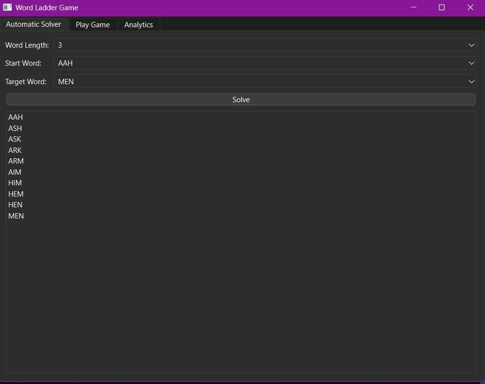
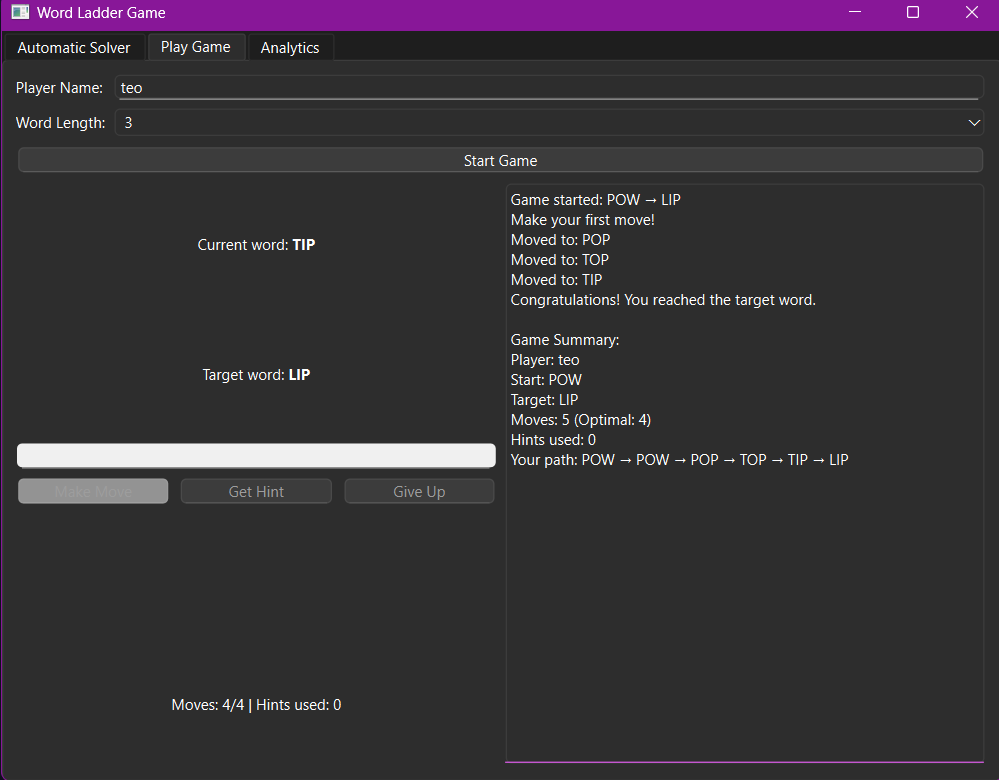
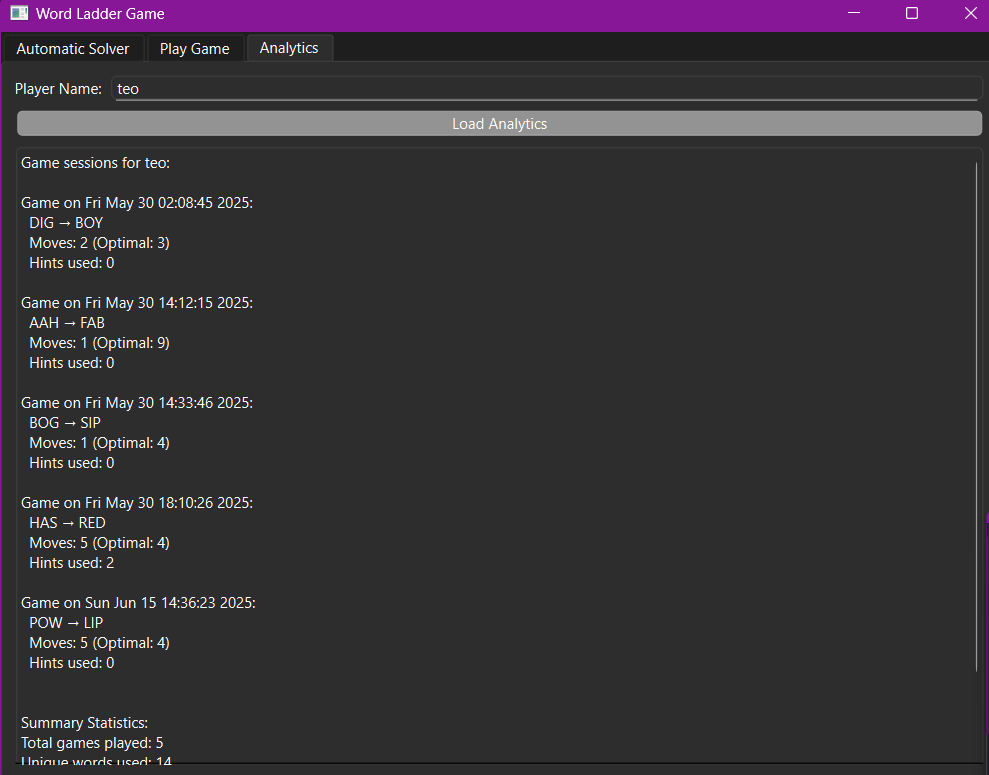

# Word Ladder Game (C++ & Qt)

A GUI-based word transformation puzzle built with C++ and Qt. The objective of the game is to transform a start word into a target word, changing only one letter at a time, with each intermediate step forming a valid word from a dictionary.

The application uses a **graph-based approach**, where each node represents a word, and edges connect words that differ by one letter. The shortest transformation path is found using **Breadth-First Search (BFS)**.

This project includes a clean Qt interface, modular logic, and detailed documentation using Doxygen.

---

## Key Features

- 🧠 **Three distinct modes:**
  - **Automatic Solver** – instantly shows the shortest path using BFS
  - **Game Session** – play manually and try to find the transformation yourself
  - **Analytics Tab** – records game data (start/target word, time, moves) and saves results in a CSV file compatible with Excel

- 💬 Real-time interactive gameplay with move validation  
- 📚 Customizable dictionary (`src/dictionary.txt`)  
- 🖼️ Qt GUI with intuitive navigation and responsive controls  
- 📖 Doxygen-generated documentation for all core components

## Building

This project was developed using **Visual Studio with Qt integration**.

### Requirements

- Visual Studio 2019 or newer
- Qt for MSVC (e.g., Qt 5.15 or 6.x)
- CMake (optional, if you use CMake instead of `.pro` files)

### Steps

1. Open the Visual Studio solution or project.
2. Make sure the Qt extension is installed and configured.
3. Build and run the project from Visual Studio.

> 📁 Note: `dictionary.txt` is located in the `src/` folder and is accessed relative to the executable. Make sure it stays in that path.

---

## Screenshots

Here’s a preview of the game in action:

